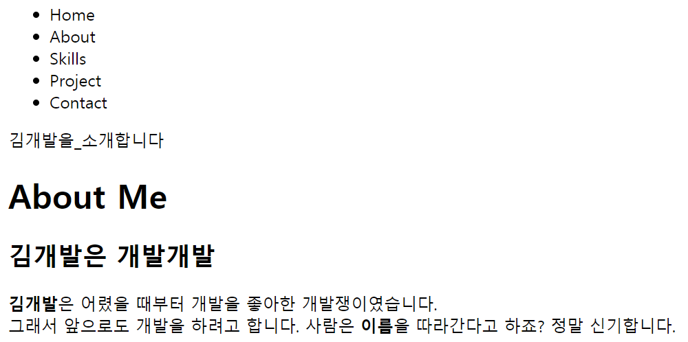
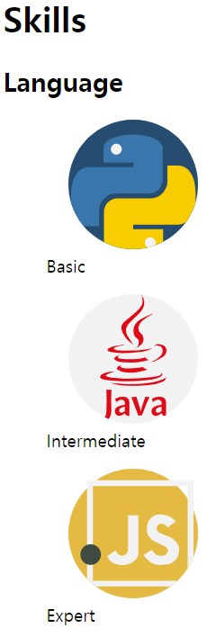
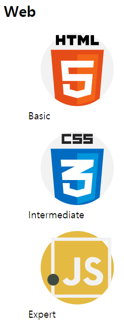
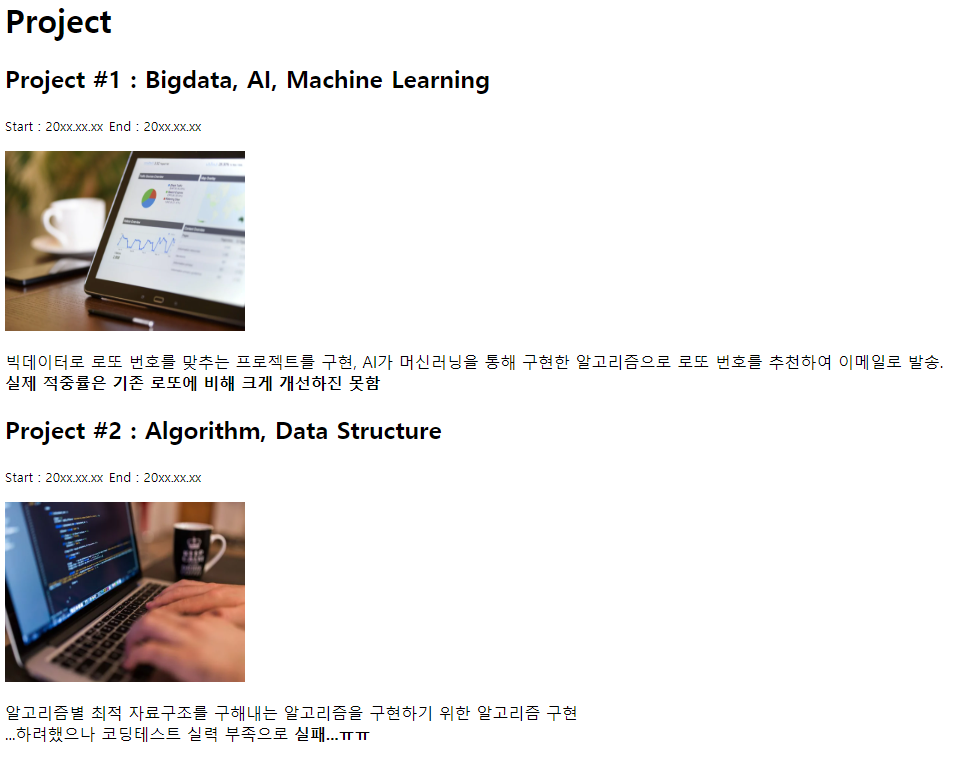
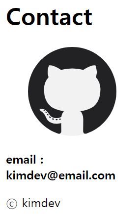

# **Phase01** : 컨텐츠 넣기
> 태그를 통해 글, 이미지, 리스트 등 웹페이지 구성하는 기본 컨텐츠를 만들어봅니다
## **예상 결과물**
### **<내비게이션 바 & 자기소개>**

===
### **<기술 소개>**

===
### **<프로젝트>**

===
### **<연락처 & 저작권>**

===
## **구성 요소**
### <글>
- 웹페이지의 제목 title 태그 [(참고)](https://ofcourse.kr/html-course/title-%ED%83%9C%EA%B7%B8)
- 제목을 넣는 h1-h6 태그 [(참고)](https://ofcourse.kr/html-course/hn-%ED%83%9C%EA%B7%B8)
- 단락을 넣는 p 태그 [(참고)](https://ofcourse.kr/html-course/p-%ED%83%9C%EA%B7%B8)
- 줄바꿈하는 br 태그 [(참고)](https://ofcourse.kr/html-course/br-%ED%83%9C%EA%B7%B8)
- 굵게 표시하는 b 태그 [(참고)](https://ofcourse.kr/html-course/b-%ED%83%9C%EA%B7%B8)
- 작은 글시를 나타내는 small 태그 [(참고)](https://www.w3schools.com/tags/tag_small.asp)
### <이미지>
- 이미지를 넣는 img 태그 [(참고)](https://ofcourse.kr/html-course/img-%ED%83%9C%EA%B7%B8)
- 이미지와 설명을 묶어주는 figure & figcaption 태그 [(참고)](https://www.w3schools.com/tags/tag_figure.asp)
- 무료 이미지 사이트
  - 무료 일반 이미지 Pixabay [(링크)](https://pixabay.com/ko/)
  - 무료 아이콘 이미지 Flaticon [(링크)](https://www.flaticon.com/)
### <리스트>
- 목록(리스트)을 나타내는 li & ul, ol 태그 [(참고)](https://ofcourse.kr/html-course/li-%ED%83%9C%EA%B7%B8)