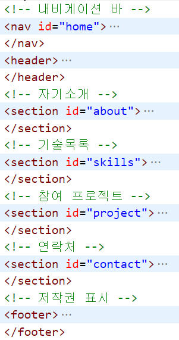
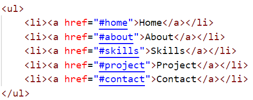

# **Phase02** : 구획 나누기 & 페이지 연결
> 컨텐츠를 각기 의미를 가지는 구획으로 나누고, 링크 태그를 통해 내·외부 페이지를 연결해봅시다.
## **예상 결과물**
### **<구획 나누기 + 이름 붙이기>**

===
### **<링크 넣기 (책갈피)>**

===
## **구성 요소**
### <구획 나누기>
- 공간을 분할하는 시맨틱 태그 [(참고)](http://tcpschool.com/html/html5_element_semantic)
### <페이지 연결>
- 페이지를 연결하는 a 태그 [(참고)](https://ofcourse.kr/html-course/a-%ED%83%9C%EA%B7%B8)
- href 속성 : 페이지 내부, 외부, 특정 위치(id 속성) [(참고)](https://www.w3schools.com/tags/att_a_href.asp)