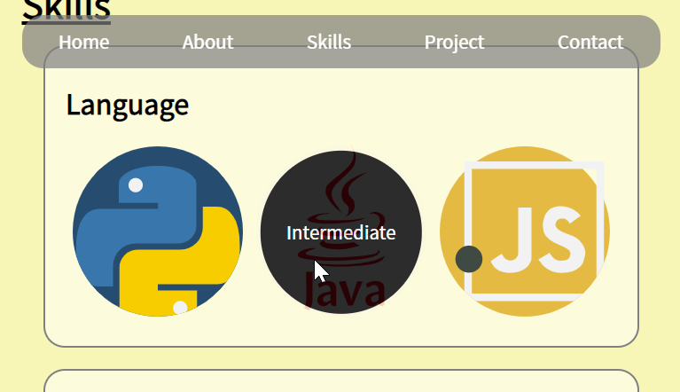

# **Phase05** : position 활용 & hover 효과 넣기
> Position을 사용해 내비게이션 바를 화면 특정 위치에 고정시키고, 커서를 위로 올렸을 경우 여러 효과가 나타나도록 합니다
## **예상 결과물**
### **<(내비게이션 바) 상단 고정>**

### **<(내비게이션 바) bold & underline>**

### **<(기술소개) 호버 시 설명 텍스트 노출>**

## **구성 요소**
### <Position 속성 & z-index>
- Position 속성 [(참고)](https://ofcourse.kr/css-course/position-%EC%86%8D%EC%84%B1)
- transform을 통한 수직, 수평 정렬 [(참고)](https://poiemaweb.com/css3-centering#3-%EC%88%98%ED%8F%89%EC%88%98%EC%A7%81-%EC%A0%95%EB%A0%AChorizontal--vertical-align)
- z-index [(참고)](https://developer.mozilla.org/ko/docs/Web/CSS/z-index)
### <가상 클래스 선택자 (hover)>
- 가상 클래스 선택자 [(참고)](https://ofcourse.kr/css-course/%EA%B0%80%EC%9E%A5-%ED%81%B4%EB%9E%98%EC%8A%A4-%EC%84%A0%ED%83%9D%EC%9E%90)
### <애니메이션>
- 투명도(Opacity) [(참고)](https://www.w3schools.com/css/css_image_transparency.asp)
- 트랜지션 [(참고)](https://developer.mozilla.org/ko/docs/Web/CSS/CSS_Transitions/Using_CSS_transitions)