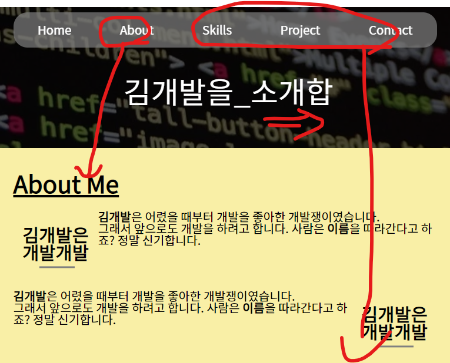

# **Phase07** : 자바스크립트를 통한 타이핑 및 스크롤 효과
> 복사 & 붙여넣기로 자바스크립트 적용된 동적 홈페이지 구현

## **예상 결과물**

> 메뉴 바 클릭 시 스크롤 효과, 웰컴 메시지에 타자기 효과 적용

## **구성 요소**
### <타이핑 효과>
- How TO - Typing Effect [(참고)](https://www.w3schools.com/howto/howto_js_typewriter.asp)
### <스크롤 효과>
- window.scroll [(참고)](https://developer.mozilla.org/en-US/docs/Web/API/Window/scroll)