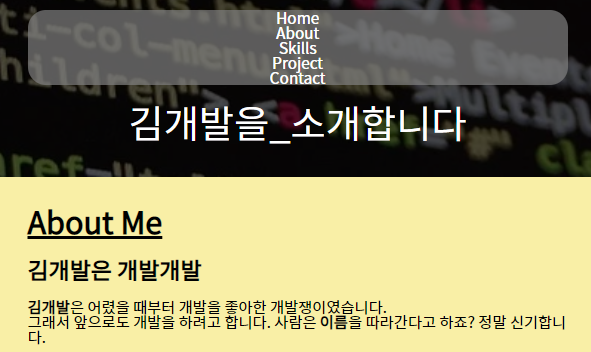
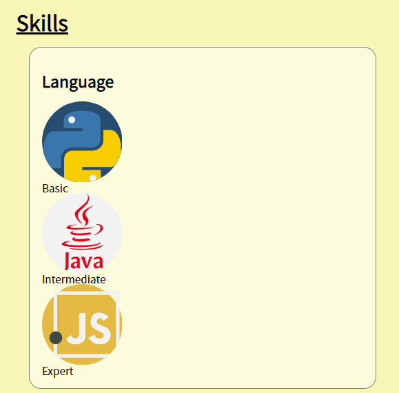
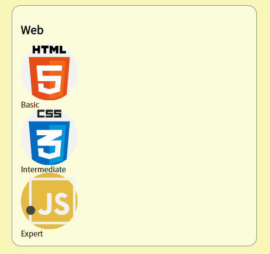
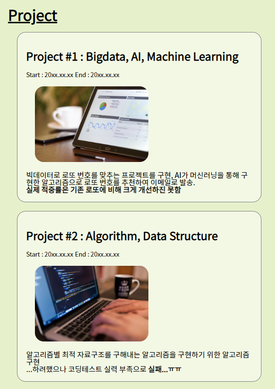
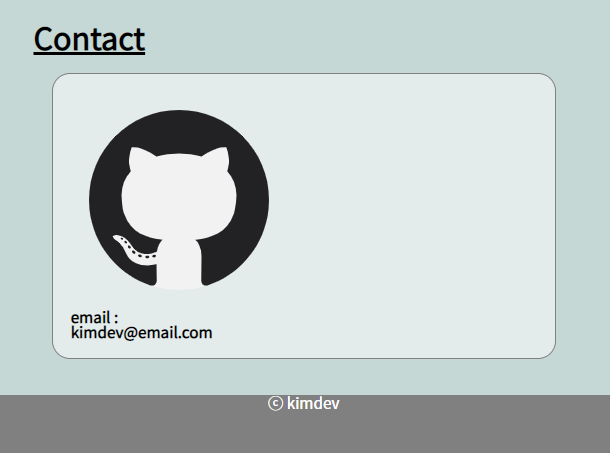

# **Phase03** : 폰트 설정 및 구획 디자인
> 전체적인 폰트를 설정하고 구획별 요소 크기와 배경색 등을 디자인해봅시다
## **예상 결과물**

## **구성 요소**
### <CSS 배우기>
- PoiemaWeb [(링크)](https://poiemaweb.com/css3-syntax)
- OfCourse [(링크)](https://ofcourse.kr/css-course/CSS-%EC%9E%85%EB%AC%B8)
- W3CSS [(링크)](https://www.w3schools.com/css/default.asp)
### <Reset CSS>
- 기본적인 HTML 요소의 CSS를 초기화 [(참고)](https://poiemaweb.com/css3-syntax#5-reset-css-%EC%82%AC%EC%9A%A9%ED%95%98%EA%B8%B0)
### <웹 폰트 설정>
- 구글 웹 폰트 [(참고)](https://fonts.google.com/?subset=korean)
### <색 조합>
- Color Hunt [(링크)](https://colorhunt.co/)