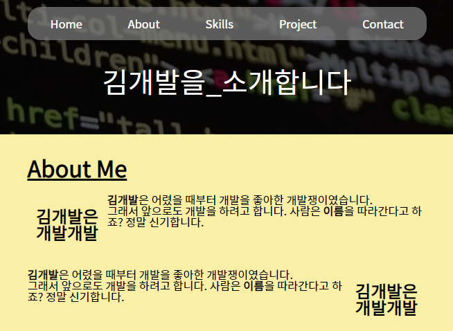
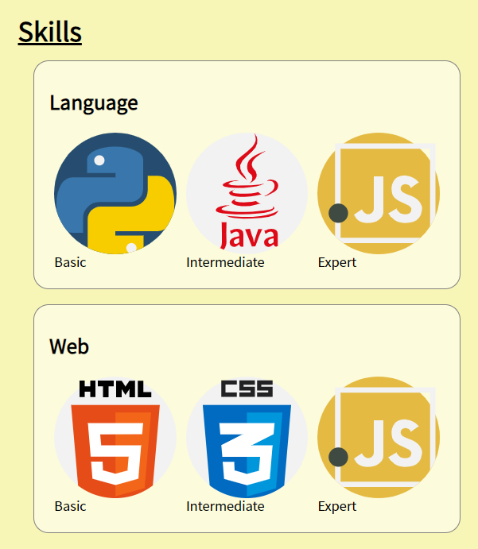
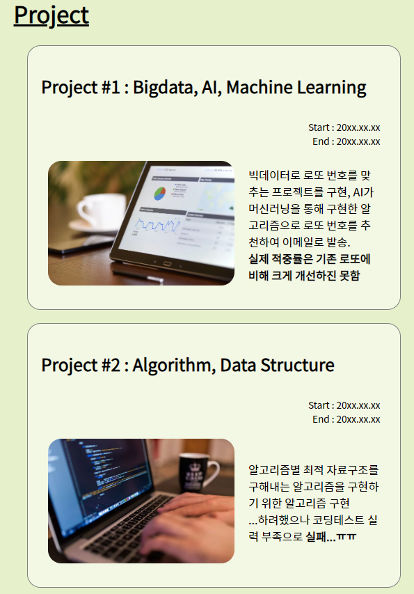
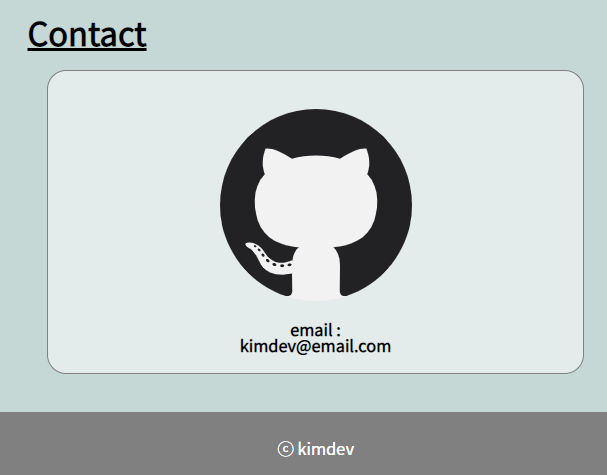

# **Phase04** : flex를 통한 정렬 & 미디어 쿼리
> CSS Flex 속성을 사용해 각종 요소들을 원하는 방식으로 정렬해 보고, 화면 크기에 대응하여 Flex 속성을 변경해봅시다
## **예상 결과물**

## **구성 요소**
### <flex 박스 개념>
- flex 박스의 개본 개념 [(참고)](https://developer.mozilla.org/ko/docs/Web/CSS/CSS_Flexible_Box_Layout/Flexbox%EC%9D%98_%EA%B8%B0%EB%B3%B8_%EA%B0%9C%EB%85%90)
### <미디어 쿼리>
- @media [(참고)](https://poiemaweb.com/css3-responsive-web-design#12-media)