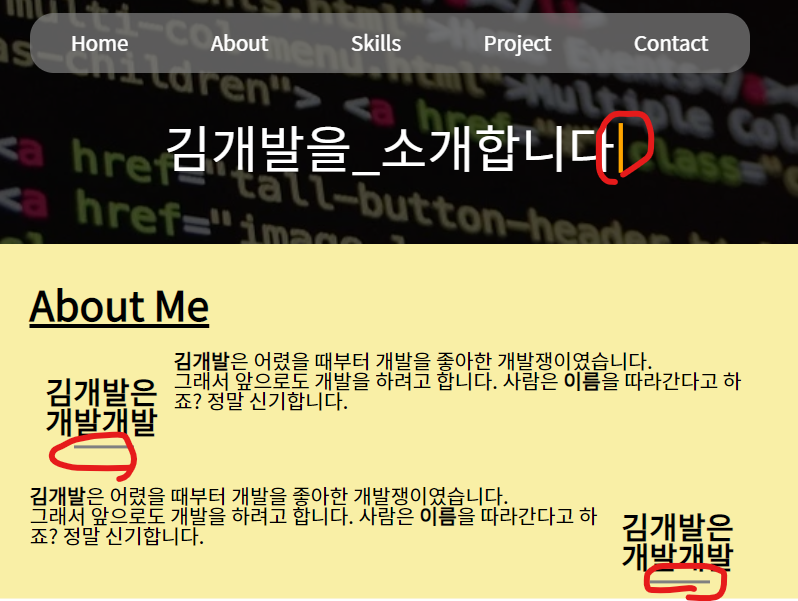

# **Phase06** : 가상 요소 선택자(after)로 요소 꾸미기 & keyframe 애니메이션 넣기
> after를 통해 요소를 꾸며주고, animation과 @keyframe 효과를 넣어 단계적 애니메이션 효과 구현

## **예상 결과물**

> welcome message에 깜빡꺼리는 커서 부착, about의 h2 제목에 회색 bar 부착, 화면 접속 시 fade-in 효과

## **구성 요소**
### <가상 요소 선택자 after>>
- ::after [(참고)](https://developer.mozilla.org/ko/docs/Web/CSS/::after)
### <@keyframe>
- animation [(참고)](https://developer.mozilla.org/ko/docs/Web/CSS/animation)
- @keyframe [(참고)](https://developer.mozilla.org/ko/docs/Web/CSS/@keyframes)